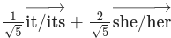

# Pronoun Space
What if we represented pronouns as a vector space? Yes, this is a dumb idea, but here is an example:

Includes both a generator for MathJax versions of these vectors and a proof that pronouns represented this way are actually a vector space.
